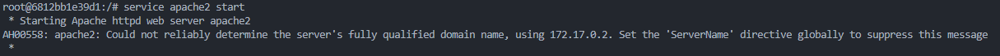
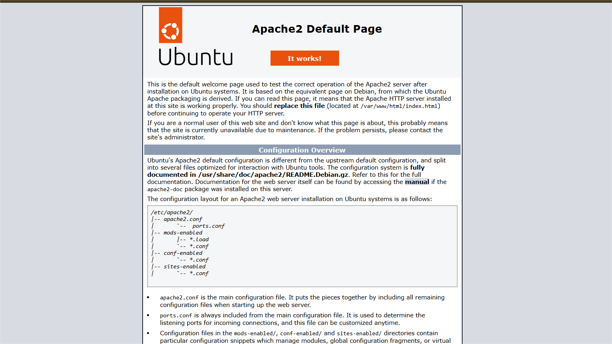
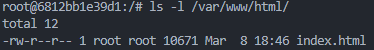
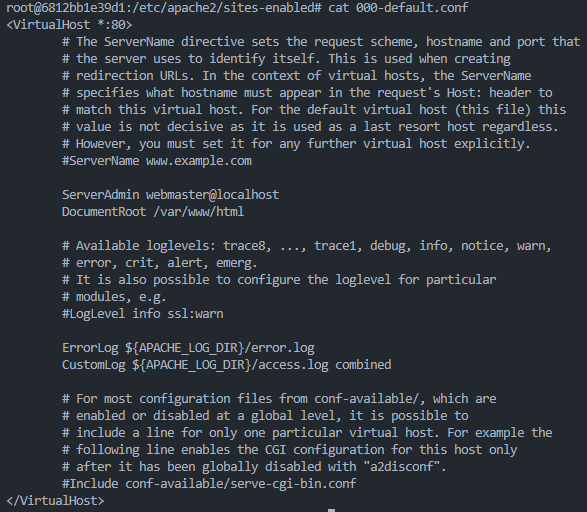
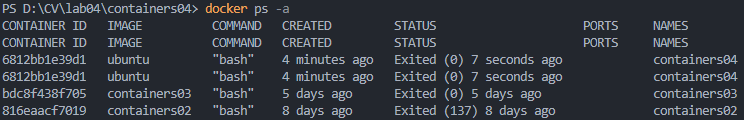

# Lucrarea de laborator nr. 4: Utilizarea containerelor ca medii de execuție

## Scopul lucrării
Această lucrare de laborator are ca scop familiarizarea cu comenzile de bază ale OS Debian/Ubuntu. De asemenea, aceasta va permite să vă familiarizați cu Docker și comenzile sale de bază utilizate.

## Sarcina
Pornind de la imaginea oficială a sistemului de operare Ubuntu, să se creeze un container care să conțină un server web **Apache**. În container, trebuie creată o pagină web care să conțină textul **"Hello, World!"**, iar aceasta să fie afișată într-un browser.

---

## Descrierea executării lucrării

### Pornirea și configurarea containerului

1. **Rulează comanda pentru crearea containerului.**
   În terminal, am executat comanda:
   ```bash
   docker run -ti -p 8000:80 --name containers04 ubuntu bash
   ```
   - **Explicație:**
     - `docker run`: Rulează un nou container.
     - `-ti`: Permite interacțiunea cu terminalul containerului.
     - `-p 8000:80`: Mapează portul 8000 al gazdei la portul 80 al containerului (unde va funcționa serverul Apache).
     - `--name containers04`: Denumește containerul `containers04`.
     - `ubuntu`: Imaginea de bază utilizată este cea oficială pentru Ubuntu.
     - `bash`: Rulează o sesiune cu shell-ul Bash.

2. **Actualizarea managerul de pachete (apt).**
   În terminalul din interiorul containerului, am introdus:
   ```bash
   apt update
   ```
   - **Explicație:** Comanda actualizează lista de pachete din depozitele Ubuntu.

3. **Instalarea serverul web Apache.**
   Am executat următoarea comandă:
   ```bash
   apt install apache2 -y
   ```
   - **Explicație:** Comanda instalează serverul Apache fără a cere confirmare suplimentară datorită opțiunii `-y`.

4. **Pornirea serviciul Apache.**
   ```bash
   service apache2 start
   ```
   - **Explicație:** Comanda pornește serverul Apache. În mod implicit, acesta va asculta pe portul 80.
   

5. **Verificarea serverul web.**
   În browser, am accesat adresa:
   ```
   http://localhost:8000
   ```
   


6. **Verificarea directorul serverului web.**
   În terminalul containerului, am verificat conținutul directorului web Apache:
   ```bash
   ls -l /var/www/html/
   ```
   
   - **Explicație:** Acesta este directorul unde se află fișierele servite de serverul Apache.
   

7. **Crearea paginii web personalizate.**
   Am introdus următoarea comandă:
   ```bash
   echo '<h1>Hello, World!</h1>' > /var/www/html/index.html
   ```
   - **Explicație:** Suprascriem pagina implicită a serverului Apache cu conținutul `<h1>Hello, World!</h1>`.
    
   Am reîmprospătat pagina web.
   


8. **Examinarea configurației serverului Apache.**
   Am executat comenzile:
   ```bash
   cd /etc/apache2/sites-enabled/
   cat 000-default.conf
   ```
   
   - **Explicație:** Fila `000-default.conf` este configurația implicită a Apache care definește rădăcina fișierelor pentru documente (de obicei, `/var/www/html`).
   

9. **Ieșirea din terminalul containerului.**
   Am introdus comanda:
   ```bash
   exit
   ```


10. **Listarea containerelor rulate.**
   În terminalul gazdă, am rulat:
    ```bash
    docker ps -a
    ```
    
    - **Explicație:** Aceasta afișează o listă de containere create (indiferent dacă sunt active sau oprite).
   


11. **Ștergerea containerului creat.**
   Introduceți comanda:
    ```bash
    docker rm containers04
    ```
    - **Explicație:** Comanda șterge definitiv containerul `containers04`.

---

## Concluzii
1. Lucrarea de laborator a demonstrat utilitatea utilizării containerelor pentru crearea unui mediu izolat în scopuri specifice, precum rularea unui server web.
2. Comenzile Docker au permis crearea rapidă a unei instanțe de sistem de operare, configurarea acesteia și rularea unui serviciu web.
3. Prin acest experiment, am înțeles cum să gestionez serviciile în cadrul unui container, inclusiv cum să creăm și să servim o pagină web personalizată.
4. Măsurile finale, cum ar fi oprirea și ștergerea containerelor, sunt esențiale pentru gestionarea resurselor sistemului.